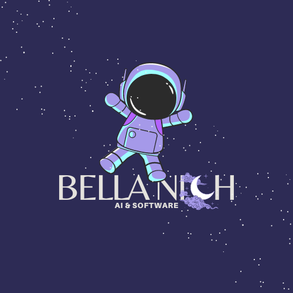
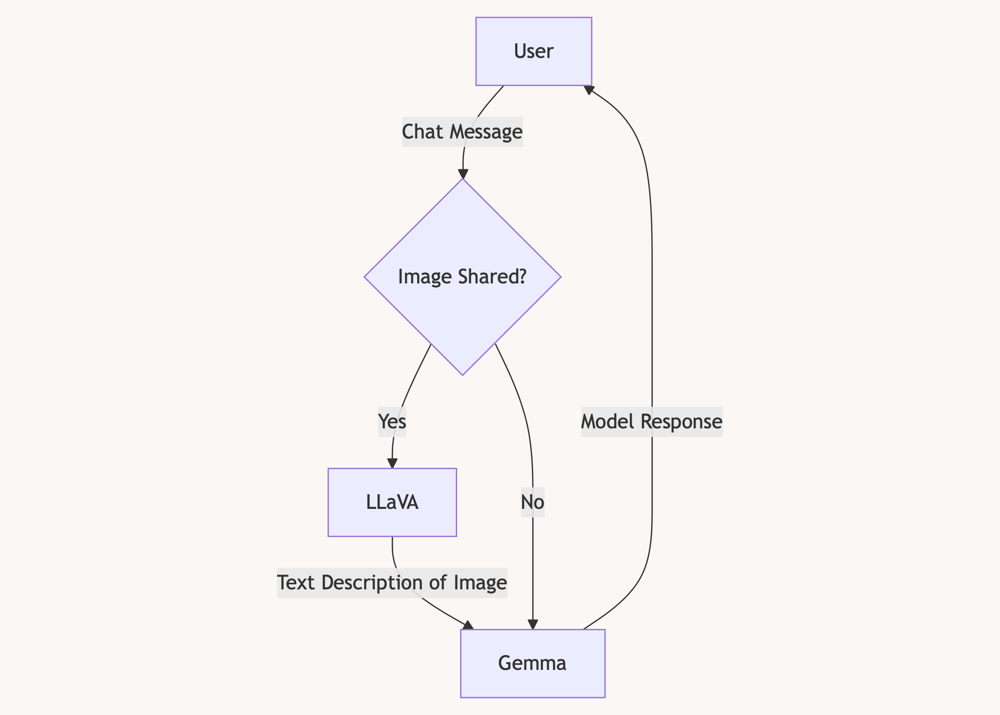

<!-- Source: https://github.com/othneildrew/Best-README-Template/pull/73 -->

<!-- PROJECT SHIELDS -->
<!--
*** https://www.markdownguide.org/basic-syntax/#reference-style-links
-->
[![Contributors][contributors-shield]][contributors-url]
[![Forks][forks-shield]][forks-url]
[![Stargazers][stars-shield]][stars-url]
[![Issues][issues-shield]][issues-url]
[![MIT License][license-shield]][license-url]
[![LinkedIn][linkedin-shield]][linkedin-url]

<!-- PROJECT LOGO -->
 

  <! -- Uncomment to turn logo image into a link -->
  

  <h3 align="center"> iOS Pocket LLM </h3>

  

   Shrinking Impossible Large, Multi-Modal LLMs to Fit on iOS Devices
     
    <a href="https://bellanich.github.io/post/edge-llm-mlc"><strong>Explore my journey »</strong></a>
     
     
    <a href="#usage">View Demo</a>
    ·
    <a href="https://github.com/bellanich/pocket-llm/issues">Report Bug</a>
    ·
    <a href="https://github.com/bellanich/pocket-llm/issues">Request Feature</a>
  

<!-- TABLE OF CONTENTS -->

  
Table of Contents

  <ol>
    <li>
      <a href="#about-the-project">About The Project</a>
      <ul>
        <!-- <li><a href="#features">Features</a></li> -->
        <li><a href="#project-structure">Project Structure</a></li>
        <!-- <li><a href="#built-with">Built With</a></li> -->
      </ul>
    </li>
    <li>
      <a href="#getting-started">Getting Started</a>
      <ul>
        <li><a href="#prerequisites">Prerequisites</a></li>
        <li><a href="#installation">Installation</a></li>
      </ul>
    </li>
    <li><a href="#usage">Usage</a></li>
    <li><a href="#contributing">Contributing</a></li>
    <li><a href="#license">License</a></li>
    <li><a href="#contact">Contact</a></li>
    <li><a href="#acknowledgments">Acknowledgments</a></li>
  </ol>

## About The Project

Generative AI has become a staple for everyday tasks, but privacy concerns arise when sharing sensitive data with cloud-hosted LLMs. It’s simply too easy to leave important information exposed. At the same time, the high cost of LLM inference puts this technology out of reach for both novices and enthusiasts alike, preventing many from experimenting and learning.

This inaccessibility has economic implications, as business ideas and innovations go unrealized. It also contributes to societal inequality by limiting access to emerging technologies. Edge computing offers a solution to both problems. By running models locally on edge devices, we can keep data private while avoiding costly cloud service bills.

Recently, edge computing has reached an exciting tipping point. Ppen-source tools, like [the Machine Learning Compiler (MLC) project](https://llm.mlc.ai), are now enabling solo developers to efficiently optimize and deploy their own foundation models on edge devices.

This repository provides the source code for deploying a multi-modal foundation model on iOS devices (laptops, iPads, and iPhones). As an example, I have extended the MLC framework to support a new custom text-vision model: [LLaVA-OneVision Qwen2 0.5B](https://huggingface.co/llava-hf/llava-onevision-qwen2-0.5b-ov-hf). Since this is a small model, fine-tuned for image annotation tasks, I deployed it alongside [Google's Gemma 2B model](https://ai.google.dev/gemma) in the pipeline shown below.

<figure>
  
  <figcaption>
  At 800M parameters, the <a href="https://llava-vl.github.io/blog/2024-08-05-llava-onevision/">LLaVA-OneVision Qwen2 0.5B</a> is ideal for edge deployment but it struggles with complex user instructions. Thus, I used Google’s ultra-efficient <a href="https://huggingface.co/google/gemma-2b">Gemma 2B model</a> as a fallback.
  </figcaption>
</figure>

For more details, check out [my corresponding blog series](https://bellanich.github.io/post/edge-llm-mlc/).

(<a href="#readme-top">back to top</a>)

### Project Structure

This project is structured as follows:

* The `ios` directory has been adapted from [the open-source MLC LLM project](https://github.com/mlc-ai/mlc-llm) to support the deploy of multi-modal models on edge devices.
* The `models` directory contains custom model definitions for the LLaVA-OneVision Qwen2 0.5B model, which I have used to extend the MLC project's underlying Python library `mlc-ai-cpu`.

    > **Note.** As of December 2024, the `mlc-ai-cpu` library is only available for download via [MLC's own Python code repository](https://mlc.ai/wheels).

* The `src` directory contains my source for serving an embedded multi-modal chatbot through a Python commandline interface (CLI). See [the "Usage" section](#usage) for a demonstration.

(<a href="#readme-top">back to top</a>)

<!-- GETTING STARTED -->
## Getting Started

Want to get started with edge LLM deployment as soon as possible? Then just follow the steps outlined below.

### Prerequisites

Make sure you have the following dependencies installed:

* [Poetry][poetry-download-link] for Python package management

### Installation

Getting started is simple. Here are the step-by-step instructions:

1. Clone this repository (`git clone https://github.com/bellanich/pocket-llm`)
2. Activate your poetry virtual environment (`poetry shell`)
3. Run `make`
   * This downloads additional project dependencies, like [Rust](https://sh.rustup.rs) and [the ` mlc-llm-cpu` Python library](https://llm.mlc.ai/docs/install/mlc_llm.html)
   * This adds custom model definitions to the `mlc-llm-cpu` library
4. Deploy your edge LLM models
    * Follow [MLC's "iOS Swift Software Development Kit" documentation](https://llm.mlc.ai/docs/deploy/ios.html) to serve a LLM an iOS device
    * Run the command `python src/main.py 2>/dev/null` to serve Gemma 2B and LLaVA-OneVision together as a Python CLI

(<a href="#readme-top">back to top</a>)

<!-- USAGE EXAMPLES -->
## Usage

Watch the demo below to see my multi-modal edge LLM pipeline process real-time inputs. The model leverages both visual and text-based information to generate intelligent responses directly on my 8G M2 MacBook Air.

As seen, this showcases the potential for foundation models to function at a high-capacity in resource-constrained environments.

 

(<a href="#readme-top">back to top</a>)

<!-- CONTRIBUTING -->
## Contributing

If you have a suggestion that would make this project better, please fork this repository and create a pull request. You can also simply open an issue with the tag "enhancement".

1. Fork the Project
2. Create your Feature Branch (`git checkout -b feature/AmazingFeature`)
1. Commit your Changes (`git commit -m 'Add some AmazingFeature'`)
2. Push to the Branch (`git push origin feature/AmazingFeature`)
3. Open a Pull Request

(<a href="#readme-top">back to top</a>)

<!-- LICENSE -->
## License

Distributed under the MIT License. See `LICENSE` file for more information.

(<a href="#readme-top">back to top</a>)

<!-- CONTACT -->
## Contact

Bella Nicholson - [@bella-nicholson](https://www.linkedin.com/in/bella-nicholson/) - bellanich.software@gmail.com

Project Link: [https://github.com/bellanich/pocket-llm](https://github.com/bellanich/pocket-llm)

(<a href="#readme-top">back to top</a>)

<!-- ACKNOWLEDGMENTS -->
## Acknowledgments

This project has been built using the following resources:

<!-- Here are the sources that I used to formulate this template repository: -->
* [The Machine Learning Compiler (MLC) Project](https://llm.mlc.ai) for its edge deployment framework and [open-source code examples](https://github.com/mlc-ai/mlc-llm)
* [Google's open source Gemma 2B model](https://ai.google.dev/gemma)
* [The Open Source LLaVA (Large Language and Vision Assistant) Models](https://llava-vl.github.io) by Haotian Liu, Chunyuan Li,  Qingyang Wu,  and Yong Jae Lee
* [The University of Amsterdam's Deep Learning Tutorials](https://uvadlc-notebooks.readthedocs.io/en/latest/) by Phillip Lippe
* [The Best README Template](https://github.com/othneildrew/Best-README-Template) by Othneil Drew

(<a href="#readme-top">back to top</a>)

<!-- END OF PAGE BUTTONS -->

  

    <a href="docs/0_overview.md" style="text-align: right;">Next Page &rightarrow; </a>
  

<!-- MARKDOWN LINKS & IMAGES -->
<!-- https://www.markdownguide.org/basic-syntax/#reference-style-links -->
[contributors-shield]: https://img.shields.io/github/contributors/bellanich/pocket-llm.svg?style=for-the-badge
[contributors-url]: https://github.com/bellanich/pocket-llm/graphs/contributors
[forks-shield]: https://img.shields.io/github/forks/bellanich/pocket-llm.svg?style=for-the-badge
[forks-url]: https://github.com/bellanich/pocket-llm/network/members
[stars-shield]: https://img.shields.io/github/stars/bellanich/pocket-llm.svg?style=for-the-badge
[stars-url]: https://github.com/bellanich/pocket-llm/stargazers
[issues-shield]: https://img.shields.io/github/issues/bellanich/pocket-llm.svg?style=for-the-badge
[issues-url]: https://github.com/bellanich/pocket-llm/issues
[license-shield]: https://img.shields.io/github/license/bellanich/pocket-llm.svg?label=license&style=for-the-badge
[license-url]: https://github.com/bellanich/pocket-llm/blob/master/LICENSE.txt
[linkedin-shield]: https://img.shields.io/badge/-LinkedIn-black.svg?style=for-the-badge&logo=linkedin&colorB=555
[linkedin-url]: https://www.linkedin.com/in/bella-nicholson/
[product-screenshot]: images/screenshot.png
<!-- Badges for tooling and frameworks  -->
[pre-commit-badge-url]: https://img.shields.io/badge/-React%2520Router?style=for-the-badge&logo=precommit&logoColor=%23FAB040&label=precommit&color=gray&link=https%3A%2F%2Fpre-commit.com
[pre-commit-website]: https://pre-commit.com
[commitlint-badge-url]: https://img.shields.io/badge/-React%2520Router?style=for-the-badge&logo=commitlint&label=commitlint&labelColor=%23000000&color=%23000000&link=https%3A%2F%2Fcommitlint.js.org%2F%23%2F
[commitlint-website]: https://commitlint.js.org/#/
[copier-badge-url]: https://img.shields.io/badge/-React%2520Router?style=for-the-badge&logo=python&logoColor=orange&label=copier&labelColor=white&color=white&link=https%3A%2F%2Fcommitlint.js.org%2F%23%2F
[copier-website]: https://copier.readthedocs.io/en/stable/
[pytest-badge-url]: https://img.shields.io/badge/-ReactJS%2520?style=for-the-badge&logo=pytest&logoColor=%230A9EDC&label=PyTest&labelColor=gray&color=gray
[pytest-website]: https://docs.pytest.org/en/7.4.x/contents.html
[github-actions-badge-url]: https://img.shields.io/badge/-ReactJS%2520?style=for-the-badge&logo=githubactions&logoColor=%232088FF&label=GitHub%20Actions&labelColor=white&color=white
[github-actions-website]: https://docs.github.com/en/actions/learn-github-actions/understanding-github-actions
[link-download-copier]: https://copier.readthedocs.io/en/stable/#installation
[github-cli-badge-url]: https://img.shields.io/badge/-React%2520Router?style=for-the-badge&logo=github&logoColor=white&label=GitHub%20CLI&labelColor=black&color=black
[github-cli-website]: https://cli.github.com
[link-download-github-cli]: https://cli.github.com/manual/
[poetry-badge-url]: https://img.shields.io/badge/-React%252520%3F?style=for-the-badge&logo=poetry&logoColor=%2360A5FA&label=Poetry&labelColor=%2310142c&color=%2310142c
[poetry-website]: https://python-poetry.org
